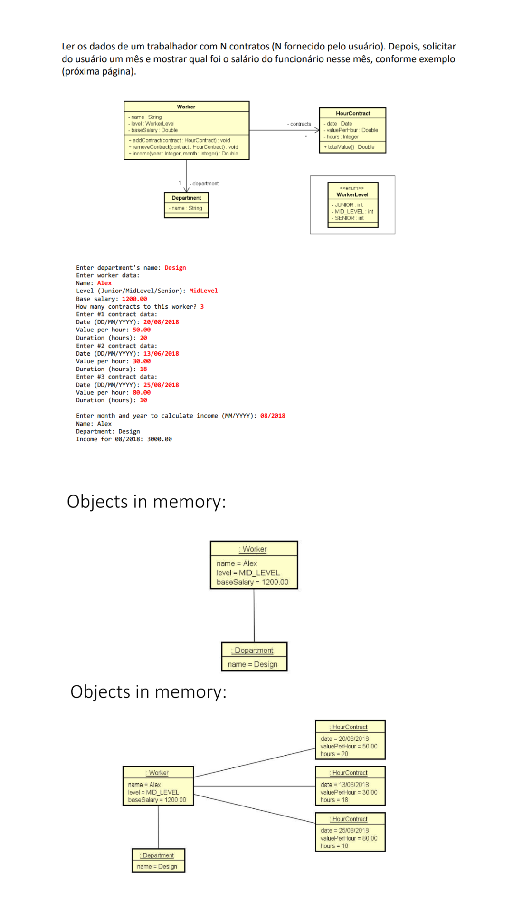

  

## 💻 Projeto

Solução criada em C# para cálculo de salário de um respectivo mês e ano, usando Enums, Entities, Classes e Métodos, conforme o modelo UML demostrado acima.

## 🚀 Tecnologias

Esse projeto foi desenvolvido com as seguintes tecnologias:

- C#
